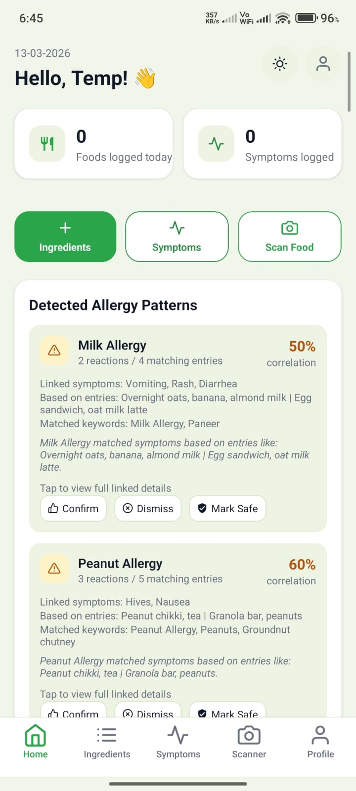
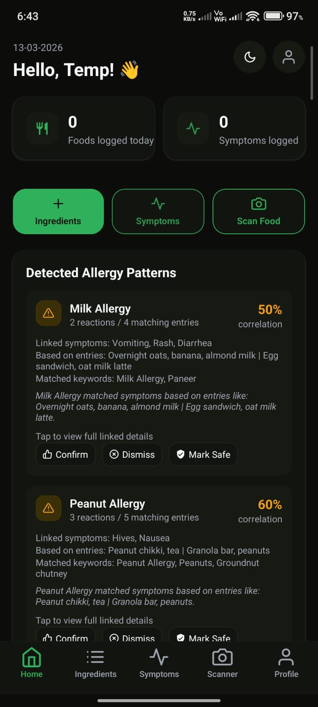
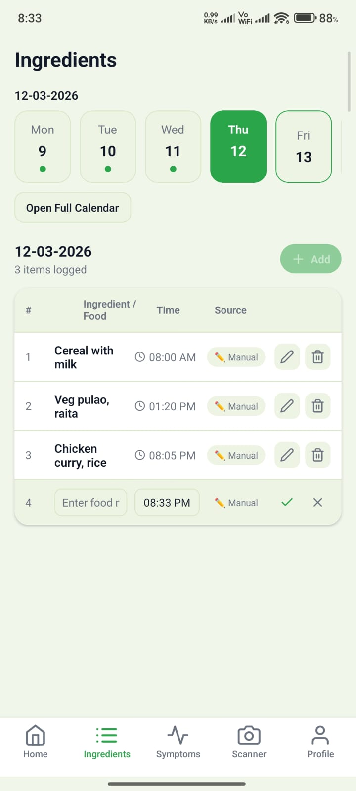
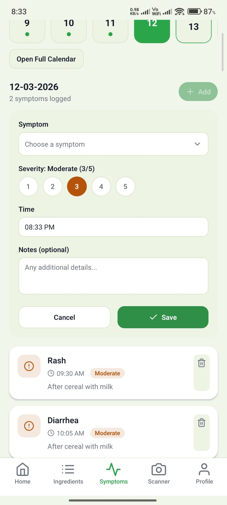
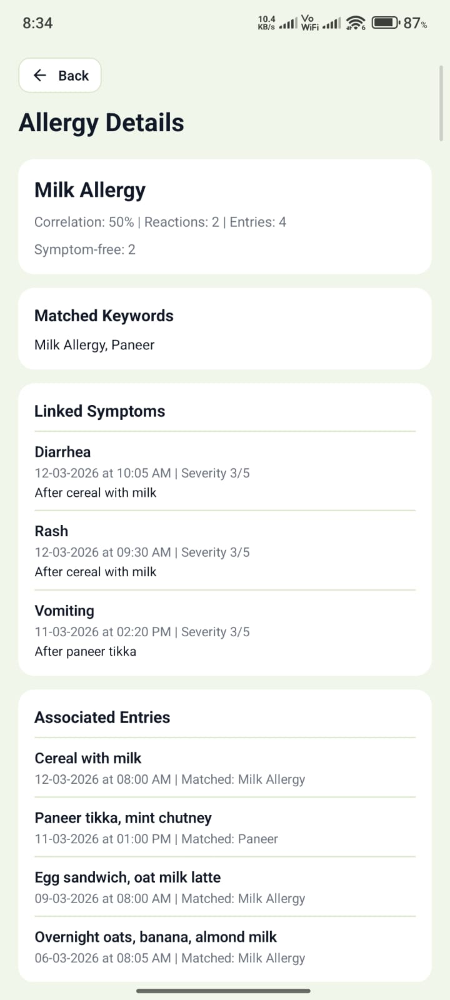

# 🩺 AllerSense

> Track. Detect. Prevent.

AllerSense is an AI-assisted mobile application that helps users identify possible food allergies by tracking meals, recording symptoms, and analyzing food-symptom patterns.

---

## ✨ Features

- 👤 User Authentication
- 🍽 Food Diary
- 🤒 Symptom Logging
- 🧠 Allergy Pattern Detection
- 📊 Personalized Insights
- 👤 User Profile
- 💾 Offline Storage

---

## 🛠 Tech Stack

- React Native
- Expo
- TypeScript
- Expo Router
- React Context API
- AsyncStorage

---

## 📂 Project Structure

```text
app/
├── login.tsx
├── signup.tsx
├── home.tsx
├── food-diary.tsx
├── symptoms.tsx
├── insights.tsx
└── profile.tsx

src/
├── components/
├── context/
├── hooks/
├── lib/
├── types/
└── utils/
```

---

## 🏗 Architecture

```
User
   │
   ▼
Screens
   │
   ▼
Context API
   │
   ▼
Business Logic
   │
   ▼
AsyncStorage
   │
   ▼
Pattern Detection
   │
   ▼
Insights
```

---

## ⚙ How It Works

1. Log meals.
2. Record allergy symptoms.
3. Compare food and symptom timing.
4. Calculate trigger probability.
5. Display possible allergens and insights.

---

## 🧠 Core Logic

The app calculates a **Trigger Score** based on how often a food is followed by symptoms.

```
Trigger Score =
(Reactions / Times Consumed) × 100
```

Foods are classified as:

- 🟢 Safe
- 🟡 Suspected
- 🔴 High Risk

---

## 🚀 Getting Started

```bash
git clone https://github.com/yourusername/AllerSense.git

cd AllerSense

npm install

npx expo start
```

---

## 🔮 Future Improvements

- 📷 Barcode Scanner
- 🤖 Machine Learning Model
- ☁ Cloud Sync
- 🔔 Notifications
- 🥗 Nutrition Analysis

---

## ⚠ Disclaimer

AllerSense is an educational project and is **not a medical diagnostic tool**. Always consult a healthcare professional for medical advice.

---

## 👨‍💻 Team

Developed for a **College Innovation Competition**.

⭐ If you like the project, consider starring the repository!

# 🩺 AllerSense

<p align="center">
  
</p>

---

## 📱 Screenshots


### Home Screen




### Food Diary



### Symptoms



### Insights


